

 

  


 

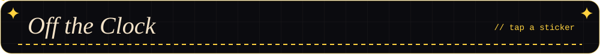

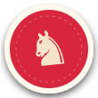 <b>Chess</b>

 

&nbsp;&nbsp;&nbsp;&nbsp;♟️ Pieces on a board, patterns in a dataset. Both reward thinking a few moves ahead.

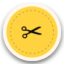 <b>Fashion design</b>

 

&nbsp;&nbsp;&nbsp;&nbsp;✂️ Silhouette, structure, fit. Pattern-making and data-wrangling are more alike than they look.

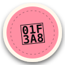 <b>Art</b>

 

&nbsp;&nbsp;&nbsp;&nbsp;🎨 Colour, composition, contrast: the same instincts I bring to dashboards.

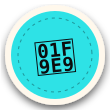 <b>Puzzles & quizzes</b>

 

&nbsp;&nbsp;&nbsp;&nbsp;🧩 Hand me a riddle, a sudoku or a quiz night and I'm in.

 

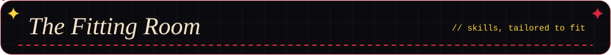

  

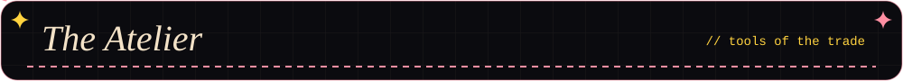

  

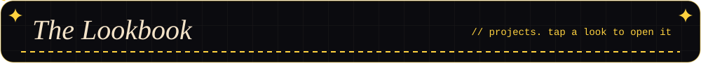

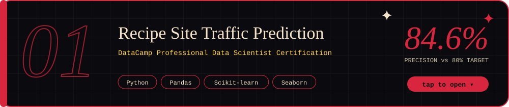

 

- Analysed **947 recipe records** to find what drives website traffic and engagement
- Cleaned data, engineered features and ran exploratory analysis
- Trained and compared **Logistic Regression, SVM, Random Forest and a Neural Network**
- Reached **84.6% precision** with Logistic Regression, beating the 80% business target
- Delivered content strategy, A/B testing plans and deployment recommendations

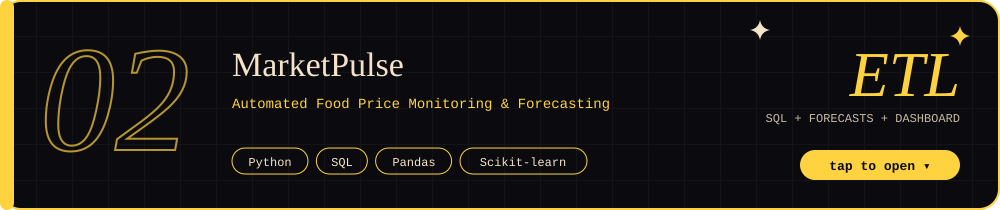

 

- Automated pipeline that collects daily wholesale food prices from public sources
- ETL workflows to clean, validate and store historical prices in **SQL**
- Exploratory analysis, anomaly detection and short-term price forecasting
- Interactive dashboard of market trends and commodity price movements
- 🔗 [View the project on GitHub](https://github.com/Kasmuu/MarketPulse-Mini---Data-Analytics-Dashboard-using-Python)

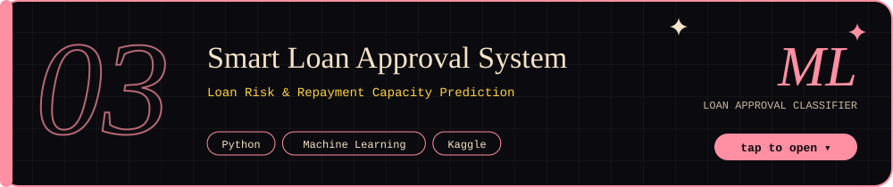

 

- Machine learning model that predicts loan approval decisions
- Data preprocessing and supervised classification
- Model evaluation to support data-driven lending
- 🔗 Kaggle: (https://www.kaggle.com/code/kashmiratamang/loan-risk-repayment-capacity-prediction)

 

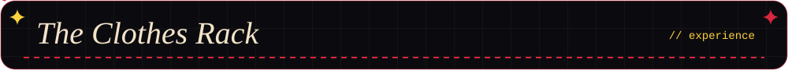
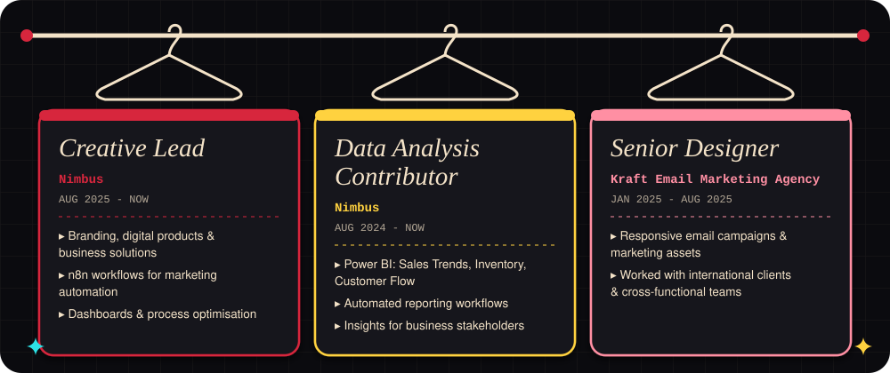

  

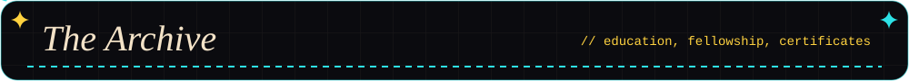
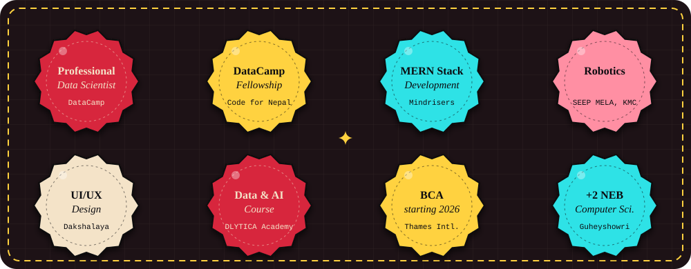

🎓 **BCA**, Thames International College *(starting 2026)* &nbsp;·&nbsp; 🏫 **+2 NEB, Computer Science**, Guheyshowri Secondary School *(2024 – 2026)*

 

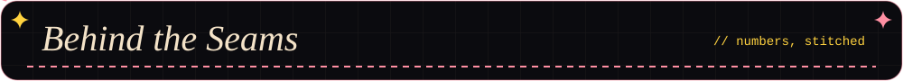
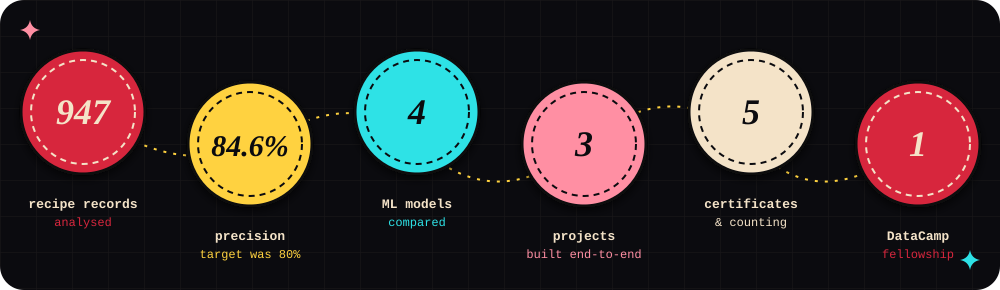

  

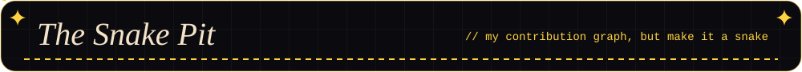

  

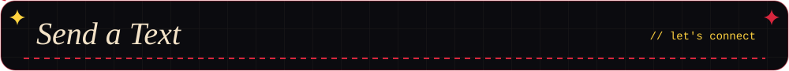

 

<!-- TODO: add Instagram / portfolio / DataLab links -->

  

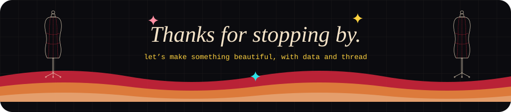

